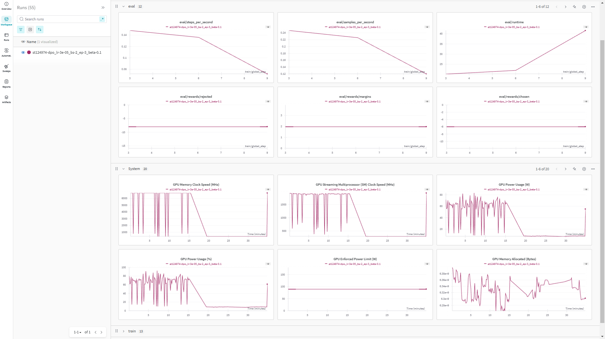
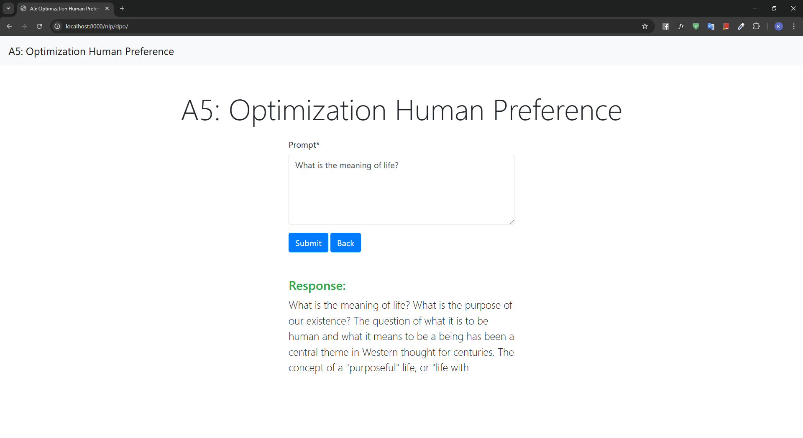

# a5-optimization-human-performance

## Student Information

- name: Kaung Sithu
- id: st124974

## Finding a suitable dataset

### Dataset

For this assignment, I used the `Dahoas/rm-static` dataset for direct preference optimization, which can be found on the [Hugging Face Hub](https://huggingface.co/datasets/Dahoas/rm-static). If you use the `Dahoas/rm-static` dataset, please cite it as follows:

```bibtex
@misc{dahoas_rm_static,
  title = {Dahoas/rm-static Dataset},
  author = {Dahoas},
  year = {2023},
  url = {https://huggingface.co/datasets/Dahoas/rm-static}
}
```

The preprocessing function `preprocess_dataset` was applied to the dataset to standardize inputs:

- Strips whitespace from `prompt`, `chosen`, and `rejected` fields.
- Returns a dictionary with cleaned text ready for training.

```python
def preprocess_dataset(sample: dict) -> dict:
    return {
        "prompt": sample["prompt"].strip(),
        "chosen": sample["chosen"].strip(),
        "rejected": sample["rejected"].strip(),
    }
```

The `load_dataset_split` function is responsible for loading and preprocessing the dataset:

- Loads a specific `split` (e.g., `train`, `test`) from the `Dahoas/rm-static` dataset using the `load_dataset` method.
- Applies the `preprocess_dataset` function to all samples.
- Supports a `sanity_check` mode to load only a small subset of the dataset for quick testing.

```python
def load_dataset_split(split: str, sanity_check: bool = False, cache_dir: str = None) -> Dataset:
    dataset = load_dataset("Dahoas/rm-static", split=split, cache_dir=cache_dir)
    if sanity_check:
        dataset = dataset.select(range(min(len(dataset), 5)))
    return dataset.map(preprocess_dataset)
```

## Training a model with DPOTrainer

The model was trained using the `DPOTrainer` class from the `trl` library. The training process involved:

- The `DPOTrainer` uses a main model and a reference model to optimize the model's response preferences.
- A batch size of `2` was used to balance memory usage and training speed.
- Hyperparameter tuning was performed using two learning rates (`3e-5`, `1e-5`) and two beta values (`0.1`, `0.2`).
- The model was evaluated at each epoch using validation loss as the key metric.
- The best model based on validation loss was saved and uploaded to the Hugging Face Hub automatically.

### Hardware Limitations

The RTX 2060 GPU has limited memory capacity (6GB), which constrained the training setup:

- **Batch Size:** set to `2` to avoid running out of memory during forward and backward passes.
- **Epochs:** limited to `3` to reduce the computational load and training time.
- **Dataset Length:** The `sanity_check` mode was enabled to only load `5` samples, ensuring that model training could fit within the GPU memory constraints.

A total of four models are experimented to find the best model using hyperparameter combinations

### Run 1: `lr=3e-5`, `beta=0.1`

| Epoch | Training Loss | Validation Loss | Rewards/chosen | Rewards/rejected | Rewards/accuracies | Rewards/margins | Logps/chosen | Logps/rejected | Logits/chosen | Logits/rejected |
|-------|---------------|----------------|----------------|------------------|--------------------|-----------------|--------------|----------------|---------------|----------------|
| 1     | No log        | 0.557057       | -0.743484      | -1.281764        | 0.500000           | 0.538280        | -126.743866  | -150.153152    | -3.201709     | -2.860964      |
| 2     | 0.398400      | 0.520812       | -1.525170      | -2.246588        | 0.666667           | 0.724118        | -134.560730  | -159.801376    | -3.280670     | -2.917840      |
| 3     | 0.398400      | 0.530221       | -1.799008      | -2.523510        | 0.666667           | 0.724502        | -137.299118  | -162.570602    | -3.289494     | -2.933159      |

### Run 2: `lr=1e-5`, `beta=0.1`

| Epoch | Training Loss | Validation Loss | Rewards/chosen | Rewards/rejected | Rewards/accuracies | Rewards/margins | Logps/chosen | Logps/rejected | Logits/chosen | Logits/rejected |
|-------|---------------|----------------|----------------|------------------|--------------------|-----------------|--------------|----------------|---------------|----------------|
| 1     | No log        | 0.532556       | -3.598132      | -5.047195        | 0.666667           | 1.449063        | -137.299698  | -162.571487    | -3.289541     | -2.933217      |
| 2     | 0.000000      | 0.532555       | -3.598191      | -5.047298        | 0.666667           | 1.449107        | -137.299988  | -162.571991    | -3.289572     | -2.933255      |
| 3     | 0.000000      | 0.532561       | -3.598219      | -5.047341        | 0.666667           | 1.449122        | -137.300110  | -162.572220    | -3.289589     | -2.933276      |

### Run 3: `lr=3e-5`, `beta=0.2`

| Epoch | Training Loss | Validation Loss | Rewards/chosen | Rewards/rejected | Rewards/accuracies | Rewards/margins | Logps/chosen | Logps/rejected | Logits/chosen | Logits/rejected |
|-------|---------------|----------------|----------------|------------------|--------------------|-----------------|--------------|----------------|---------------|----------------|
| 1     | No log        | 0.513055       | -2.473351      | -3.381426        | 0.833333           | 0.908075        | -144.042526  | -171.149765    | -3.371381     | -3.099240      |
| 2     | 0.000000      | 0.538839       | -2.875102      | -3.856045        | 0.833333           | 0.980943        | -148.060043  | -175.899590    | -3.394568     | -3.172655      |
| 3     | 0.000000      | 0.539542       | -2.978933      | -3.967966        | 0.833333           | 0.989033        | -149.098358  | -177.015152    | -3.400038     | -3.186575      |

### Run 4: `lr=1e-5`, `beta=0.2`

| Epoch | Training Loss | Validation Loss | Rewards/chosen | Rewards/rejected | Rewards/accuracies | Rewards/margins | Logps/chosen | Logps/rejected | Logits/chosen | Logits/rejected |
|-------|---------------|----------------|----------------|------------------|--------------------|-----------------|--------------|----------------|---------------|----------------|
| 1     | No log        | 0.666068       | -5.957865      | -7.935932        | 0.833333           | 1.978067        | -149.098358  | -177.015152    | -3.400038     | -3.186575      |
| 2     | 0.000000      | 0.666068       | -5.957865      | -7.935932        | 0.833333           | 1.978067        | -149.098358  | -177.015152    | -3.400038     | -3.186575      |
| 3     | 0.000000      | 0.666068       | -5.957865      | -7.935932        | 0.833333           | 1.978067        | -149.098358  | -177.015152    | -3.400038     | -3.186575      |

I added the logs of the best model to Wandb



## Pushing the Model to Hugging Face Hub

The best model is uploaded to Hugging Face Hub after training. You can see it from this link <https://huggingface.co/archx64/best-dpo-Qwen-Qwen2-0.5B-Instruct/tree/main>

## Web Application Development

Navigate to the `app` directory and execute the following command

```zsh
python manage.py runserver
```

you can access the application at localhost:8000/


